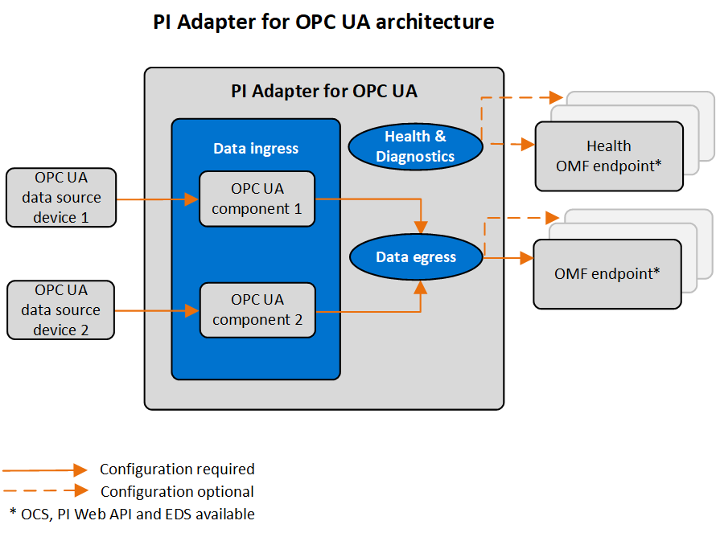

# PI Adapter for OPC UA overview

The PI Adapter for OPC UA is a data-collection component that transfers time-series data from source devices to OMF endpoints in OSIsoft Cloud Services or PI Servers. OPC UA (OPC Unified Architecture) is an open standard, machine-to-machine communication protocol for industrial automation developed by the OPC Foundation. The adapter can connect to any device that uses the OPC UA communication protocol.

You can install the adapter with a download kit that you can obtain from the OSIsoft Customer Portal. You can install the adapter on devices running either Windows or Linux operating systems.

Using the REST API, you can configure all functions of the adapter. The configurations are stored in JSON files. For data ingress, you must define an adapter component in the system components configuration for each device to which the adapter will connect. You configure each adapter component with the connection information for the device and the data to collect. For data egress, you must specify destinations for the data, including security for the outgoing connection. Additional configurations are available to egress health and diagnostics data, add buffering configuration to protect against data loss, and record logging information for troubleshooting purposes.

Once you have configured the adapter and it is sending data, administration functions are used to manage the adapter or individual ingress components of the adapter. Health and diagnostics functions monitor the status of connected devices, adapter system functions, the number of active data streams, the rate of data ingress, the rate of errors, and the rate of data egress.

The EdgeCmd utility is an OSIsoft proprietary command line tool that is used to configure and administer an adapter on both Linux and Windows operating systems. It is installed separately from the adapter.

<!--
# PI Adapter for OPC UA

=======

- [PI Adapter for OPC UA overview](xref:PIAdapterForOPCUAOverview)
  - [PI Adapter for OPC UA principles of operation](xref:PIAdapterForOPCUAPrinciplesOfOperation)
- [Installation](xref:Installation)
  - [Install the adapter](xref:InstallTheAdapter)
  - [Install PI Adapter for OPC UA using Docker](xref:InstallPIAdapterForOPCUAUsingDocker)
  - [Uninstall the adapter](xref:UninstallTheAdapter)
- [Configuration](xref:OPCUAConfiguration)
  - [Configuration tools](xref:ConfigurationTools)
  - [System components configuration](xref:SystemComponentsConfiguration)
  - [PI Adapter for OPC UA data source configuration](xref:PIAdapterForOPCUADataSourceConfiguration)
  - [PI Adapter for OPC UA data selection configuration](xref:PIAdapterForOPCUADataSelectionConfiguration)
  - [PI Adapter for OPC UA security configuration](xref:PIAdapterForOPCUASecurityConfiguration)
  - [Egress endpoints configuration](xref:EgressEndpointsConfiguration)
  - [Health endpoint configuration](xref:HealthEndpointConfiguration)
  - [Diagnostics configuration](xref:DiagnosticsConfiguration)
  - [Buffering configuration](xref:BufferingConfiguration)
  - [Logging configuration](xref:LoggingConfiguration)
  - [System and adapter configuration](xref:SystemAndAdapterConfiguration)
- [Administration](xref:Administration)
  - [Start and stop an adapter](xref:StartAndStopAnAdapter)
  - [Start and stop ingress component](xref:StartAndStopIngressComponent)
  - [Retrieve product version information](xref:RetrieveProductVersionInformation)
  - [Delete an adapter component](xref:DeleteAnAdapterComponent)
- [Health and diagnostics](xref:HealthAndDiagnostics)
  - [Adapter health](xref:AdapterHealth)
    - [Device status](xref:DeviceStatus)
    - [Next health message expected](xref:NextHealthMessageExpected)
  - [Adapter diagnostics](xref:AdapterDiagnostics)
    - [System](xref:System)
    - [Stream count](xref:StreamCount)
    - [IO rate](xref:IORate)
    - [Error rate](xref:ErrorRate)
  - [Egress diagnostics](xref:EgressDiagnostics)
-->
  
